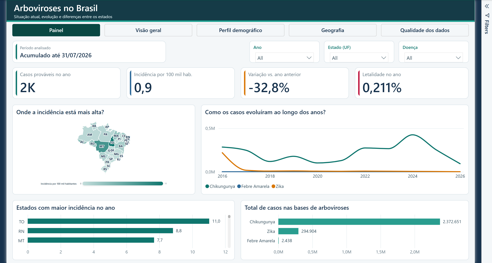

# Dashboard de Evolução do Zika Vírus no Brasil

Projeto acadêmico desenvolvido em Power BI para acompanhar a evolução temporal, espacial, demográfica e qualitativa das notificações de Zika no Brasil entre 2016 e 2026.

**Autores:** Mateus Rodrigues Zerbini e Cauan Teixeira Jardim  
**Data da entrega final:** 08/08/2026  
**Data de corte dos registros:** 31/07/2026



## Resultado da entrega

O dashboard final possui cinco páginas com identidade visual uniforme:

1. **Painel:** situação atual, incidência, variação anual, letalidade, mapa e comparação de arboviroses;
2. **Visão geral:** notificações, confirmações e sazonalidade;
3. **Perfil demográfico:** sexo, idade, raça/cor e escolaridade;
4. **Geografia:** distribuição por UF e região e tendência recente calculada em Python;
5. **Qualidade dos dados:** classificação, critério, evolução, gestação e incompletude.

Indicadores da versão entregue:

| Indicador | Resultado |
|---|---:|
| Notificações de Zika | 556.082 |
| Casos confirmados | 179.461 |
| Taxa de confirmação | 40,77% |
| Gestantes notificadas | 57.982 |
| Óbitos atribuídos ao agravo | 89 |
| Casos prováveis em 2026 até o corte | 1.897 |
| Incidência em 2026 | 0,9 por 100 mil habitantes |
| Variação contra o mesmo período de 2025 | -32,8% |
| Letalidade exibida em 2026 | 0,211% |

> Notificação não equivale a caso confirmado. Os casos prováveis seguem a definição da fonte oficial: todas as notificações suspeitas, exceto as descartadas.

## Estrutura do repositório

```text
.
├── dashboard/
│   ├── Projeto.pbip
│   ├── Projeto.Report/
│   └── Projeto.SemanticModel/
├── data/  (criada após extrair o pacote de dados)
│   ├── auxiliares/
│   │   ├── municipios.csv
│   │   └── populacao_ibge_2025.csv
│   ├── derivados/
│   │   ├── arboviroses_comparacao_snapshot.csv
│   │   ├── tendencia_zika_uf.csv
│   │   └── zika_mensal_uf_24m.csv
│   └── sinan_zika/
│       └── ZIKABR16.csv ... ZIKABR26.csv
├── docs/
│   ├── images/
│   ├── objetivo_projeto.pdf
│   └── VALIDACAO.md
├── scripts/
│   ├── analise_tendencia_zika.py
│   └── configurar_caminhos.ps1
├── requirements.txt
└── .gitignore
```

## Fontes utilizadas

- [SINAN/Vírus Zika — Portal de Dados Abertos do SUS](https://dadosabertos.saude.gov.br/dataset/arboviroses-zika-virus)
- [Arboviroses — Febre de Chikungunya](https://dadosabertos.saude.gov.br/dataset/arboviroses-febre-de-chikungunya)
- [Portal de Dados Abertos do SUS](https://dadosabertos.saude.gov.br/dataset), para Febre Amarela
- [Estimativas da população — IBGE](https://www.ibge.gov.br/estatisticas/sociais/populacao/9103-estimativas-de-populacao.html)
- Cadastro auxiliar de municípios e UFs do IBGE

O endereço de download inicialmente indicado para os arquivos históricos de Zika não estava funcionando. Com aprovação, foi adotado o conjunto oficial **Sinan/Vírus Zika** do Portal de Dados Abertos do SUS.

Chikungunya e Febre Amarela são bases adicionais usadas na comparação entre arboviroses. Os arquivos de comparação e tendência presentes em `data/` são derivados dessas fontes e do SINAN/Zika; não constituem novas fontes externas.

## Como executar o projeto

### 1. Baixar o pacote de dados

Baixe o pacote consolidado com todas as bases necessárias:

- [Download — bases do Dashboard de Zika (Google Drive)](https://drive.google.com/uc?export=download&id=1UKDthnx4YI3rX2fZINzRIHVWAmuz6CJM)

Crie uma pasta chamada `data` na raiz do repositório e extraia o conteúdo do ZIP diretamente dentro dela. O ZIP já começa pelas pastas `auxiliares`, `derivados` e `sinan_zika`; não crie outro nível de pasta.

Ao final, a estrutura deve conter diretamente os caminhos `data/auxiliares`, `data/derivados` e `data/sinan_zika`. Confirme também que existe o arquivo `data/sinan_zika/ZIKABR26.csv`. Como nenhuma base é versionada no repositório, a extração não deve solicitar substituição de arquivos.

As bases de dados não são versionadas no GitHub e devem ser obtidas por esse pacote. A origem oficial dos dados continua indicada na seção **Fontes utilizadas**.

### 2. Ajustar os caminhos locais

No PowerShell, a partir da raiz do repositório, execute:

```powershell
powershell -ExecutionPolicy Bypass -File .\scripts\configurar_caminhos.ps1
```

O script aponta as consultas do PBIP para a pasta local clonada, sem modificar as regras de negócio.

### 3. Abrir e atualizar

Abra `dashboard/Projeto.pbip` no Power BI Desktop e selecione **Atualizar**.

### 4. Recalcular a tendência em Python

```powershell
python -m pip install -r requirements.txt
python .\scripts\analise_tendencia_zika.py .\data\derivados\zika_mensal_uf_24m.csv .\data\derivados\tendencia_zika_uf.csv
```

## Modelo analítico

O modelo final possui oito tabelas:

- `fdata`: fato principal de notificações;
- `dDates`: calendário;
- `dMunicipalities`: municípios;
- `Populacao`: UF, região e denominador populacional;
- `Arboviroses`: comparação mensal entre doenças;
- `TendenciaPython`: regressão linear dos últimos 24 meses por UF;
- `Completude`: qualidade de campos;
- `_Mensures`: medidas DAX centralizadas.

Os relacionamentos são muitos-para-um e unidirecionais das tabelas fato para as dimensões.

## Limitações

- Os registros representam notificações, não exclusivamente casos confirmados.
- O período de 2026 é parcial, com corte em 31/07/2026.
- A incidência usa a estimativa populacional de 2025.
- A regressão linear descreve tendência, não previsão nem causalidade.
- A correlação direta com microcefalia não foi incorporada por ausência de um extrato oficial aberto e compatível no projeto.
- A base contém um registro de 2026 simultaneamente marcado como descartado e como óbito pelo agravo; essa inconsistência está registrada em `docs/VALIDACAO.md`.

## Observação sobre arquivos locais

O Power BI cria arquivos de cache e configurações específicos de cada computador dentro de `.pbi`. Eles estão excluídos pelo `.gitignore` e não devem ser publicados.
